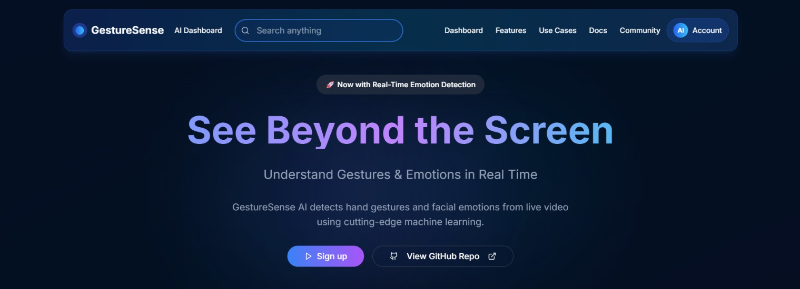

# 🧠🖐️ GestureSense AI



A real-time, AI-powered web application that detects **hand gestures**, **facial emotions**, and **speech commands** directly from your webcam or uploaded photo — all in your browser. Fast, accurate, and privacy-respecting.

## 🌟 Features

* 🖐️ Real-time **hand gesture detection** (thumbs up, peace, OK, stop, etc.)
* 😀 Instant **facial emotion recognition** (happy, sad, angry, surprised, neutral)
* 🎤 **Speech command recognition** for voice-based interactions
* 🖼️ Upload your photo to **test gestures and emotions**
* 📷 Webcam-based **live gesture detection**
* 🧠 Built using modern ML tools like **MediaPipe**, **TensorFlow**, and **OpenCV**
* 🔒 **100% client-side** — no image, video, or audio is uploaded to a server

## 🛠️ Technologies Used

* **HTML5** – Markup for UI structure  
* **CSS3** – Responsive and modern design  
* **JavaScript (Vanilla)** – Core logic and real-time webcam processing  
* **TensorFlow.js** – For facial emotion classification  
* **MediaPipe** – For hand and face landmark tracking  
* **OpenCV.js** – Image preprocessing and camera feed handling
* **Web Speech API** – For speech recognition

## ⚙️ Installation

1. Clone the repository:
```bash
git clone https://github.com/BikramMondal5/GestureSense-AI.git
```

2. Navigate to the project directory:
```bash
cd GestureSense-AI
```

3. Install dependencies:
```bash
npm install
```
or 
```bash
npm install --legacy-peer-deps
```
4. Start the development server:
```bash
npm run dev
```

## 🚀 How to Use

1. Open the application in your browser after starting the development server.
2. Allow access to your webcam and microphone when prompted.
3. Use the following features:
   - **Hand Gesture Detection**: Perform gestures like thumbs up, peace, or stop in front of the webcam.
   - **Facial Emotion Recognition**: Express emotions like happy, sad, or surprised for instant recognition.
   - **Speech Command Recognition**: Speak commands like "start", "stop", or "help" to interact with the application.
4. Optionally, upload a photo to test gesture and emotion detection on static images.
5. Explore the results displayed in real-time on the screen.
6. Create a `.env` file in the root directory by copying `.env.example`:
```bash
cp .env.example .env
```
7. Rename the `.env.example` file to `.env` and update the `POSTGRES_PASSWORD` field in the file with your PostgreSQL password.

## 🤝 Contribution

Feel free to fork this repository, raise issues, or submit pull requests to add features or improve the design.

## 📜 License

This project is licensed under the `MIT License`.